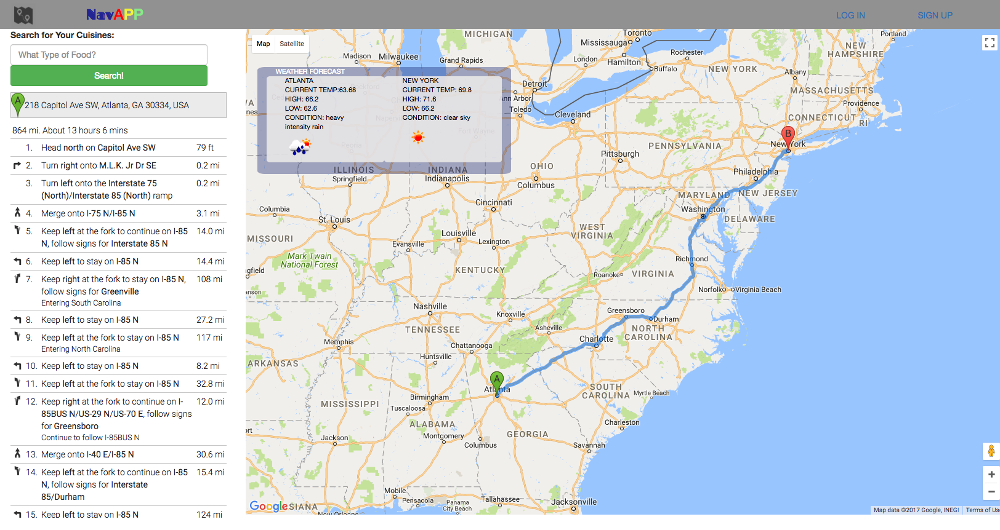

# FrontEndProject
## [Demo Link](http://binhchung.com/navapp/)
NavAPP is an extraordinary roadtrip planner that will help you map out your next destination, look up realtime weather information, and find places to eat nearby. 
## Meet the Team!
- As a Team
	
- As a team, we all contributed to the idea, layout as well as the functions of the project. We used google map's API to map out the directions and direct route from A to B. We also worked on how to get data from one page to our second page.

- [Binh Chung](https://github.com/binhc) 
 Wireframe, HTML, CSS, Google Maps 
 
	
- [Jong Park](https://github.com/maclay13531)
	
- Main contribution was to extract weather API & forecast API data to show weathers of current and future days on our map page.
	Styled the front landing part(video and title).
	

- [Jason Li](https://github.com/2monsta)
	
- My main contribution is that I used zomato's API to extract data back for the search button on map page as well as basic styles to our page.

## Initial Wire Frame

## How to Use
1. Type Start Address in first Box and End Address in second Box. 
2. Click Go!
3. Enter type of cusine in search box to find nearby restaurants (make sure you allow location data!)
## Landing Page

## Map Page

## Tools
- Sketch
- Google Maps API 
- Open Weather Maps API 
- Zomato API 
- Bootstrap, jQuery
- JavaScript
## What We Learned 
From this project, we learned how to utilize git branches to resolve merge conflicts. Most importantly, we learned how to work as a team. We learned how to work with different APIs such as google maps API and open weather API and how to pull data from multiple sources. 
## Challenges and Solutions
1. Moving data from page one to two (utilized local storage)
2. Centering the map after getting two locations (fitbounds)
3. Getting the zoom to be correct according to distance
4. Route directions 
5. Embeded video inside Front Page

## Improvements/ Additional Features
- Fix enter button bug on landing page 
- Remove the setimeOut function when using geocoder
- Better scoping order in JS File 
- Responsiveness of page 
- Switch from local storage to database/server for data storage
- Add pre-set trips 
- Add 5 Day forecast option to weather forecase feature 

